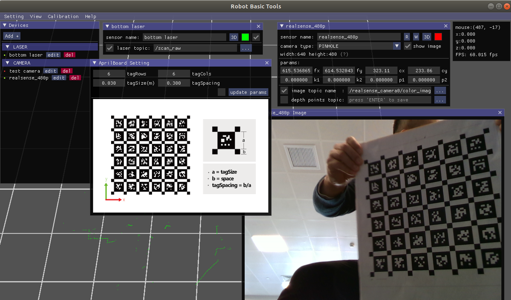
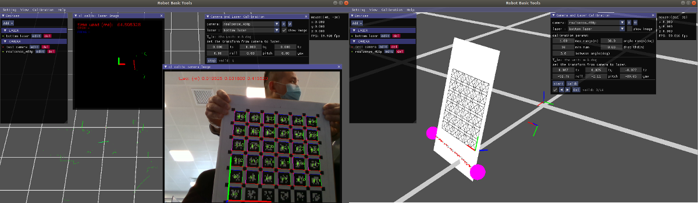

# 机器人基础工具箱
[](https://www.codacy.com/gh/hardjet/robot_basic_tools/dashboard?utm_source=github.com&amp;utm_medium=referral&amp;utm_content=hardjet/robot_basic_tools&amp;utm_campaign=Badge_Grade)
## 简介
机器人基础工具箱(Robot Basic Tools, 简称RBT)旨在对机器人上常用的传感器，比如相机、单多线激光雷达、IMU、里程计等，进行单个或者多个传感器的内外参标定，对不同传感器数据进行时序分析。本工具基于openGL开发，为用户提供了友善的UI界面与明晰的结果展示。

工具界面


标定展示


## 依赖说明
本工具依赖以下开源库或工程：

- [gl3w-Simple OpenGL core profile loading](https://github.com/skaslev/gl3w)：openGL相关
- [glfw](https://www.glfw.org/)：openGL相关
- [Dear ImGui](https://github.com/ocornut/imgui)：GUI框架
- [Portable File Dialogs](https://github.com/samhocevar/portable-file-dialogs)：GUI 文件对话框
- [ROS](https://www.ros.org/)：通信与机器人交互
- [openCV](https://opencv.org/): 图像数据处理相关
- [ceres](http://ceres-solver.org/): 优化库
- [nlohmann-json](https://github.com/nlohmann/json): json数据处理相关
- [camera_model](https://github.com/gaowenliang/camera_model): 相机模型相关

**ui框架参考了[interactive_slam](https://github.com/SMRT-AIST/interactive_slam) @koide3**。

## 安装

**本工具测试环境为Ubuntu 18.04，建议系统版本 >= Ubuntu 18.04。**

### opengl相关环境

```cmd
sudo apt install libglm-dev libglfw3-dev
```

### ceres
参考[Installation](http://ceres-solver.org/installation.html):Linux

```cmake
# 安装ceres依赖
# CMake
sudo apt-get install cmake
# google-glog + gflags
sudo apt-get install libgoogle-glog-dev libgflags-dev
# BLAS & LAPACK
sudo apt-get install libatlas-base-dev
# Eigen3
sudo apt-get install libeigen3-dev
# SuiteSparse and CXSparse (optional)
sudo apt-get install libsuitesparse-dev

# 下载
git clone https://ceres-solver.googlesource.com/ceres-solver
# 安装
tar zxf ceres-solver-2.0.0.tar.gz
mkdir ceres-bin
cd ceres-bin
cmake ../ceres-solver-2.0.0
make -j3
make test
# Optionally install Ceres, it can also be exported using CMake which
# allows Ceres to be used without requiring installation, see the documentation
# for the EXPORT_BUILD_DIR option for more information.
make install
```

### opencv

参考[Installation in Linux](https://docs.opencv.org/master/d7/d9f/tutorial_linux_install.html):Build core modules

```cmake
# 安装opencv依赖
sudo apt-get install \
    libgtk-3-dev \
    libjpeg-dev \
    libpng++-dev \
    libtiff-dev \
    libopenexr-dev \
    libwebp-dev \
    ffmpeg \
    libavcodec-dev \
    libavformat-dev \
    libavutil-dev \
    libswscale-dev \
    libavresample-dev

# 编译
cmake \
    -DCMAKE_BUILD_TYPE=Release \
    -DCMAKE_INSTALL_PREFIX=/usr/local \
    -DBUILD_DOCS=OFF \
    -DBUILD_EXAMPLES=OFF \
    -DBUILD_JASPER=OFF \
    -DBUILD_OPENEXR=OFF \
    -DBUILD_PERF_TESTS=OFF \
    -DBUILD_TESTS=OFF \
    -DBUILD_opencv_apps=OFF \
    -DBUILD_opencv_dnn=OFF \
    -DBUILD_opencv_ml=OFF \
    -DBUILD_opencv_python_bindings_generator=OFF \
    -DENABLE_CXX11=ON \
    -DENABLE_FAST_MATH=ON \
    -DWITH_EIGEN=ON \
    -DWITH_FFMPEG=ON \
    -DWITH_OPENMP=ON ..
```

### ros

根据自己系统安装相应的版本，参考[ros wifi](http://wiki.ros.org/ROS/Installation)。

[ubuntu 18.04](http://wiki.ros.org/melodic/Installation/Ubuntu)安装参考

### robot basic tools

```cmake
# 获取代码
git clone https://github.com/hardjet/robot_basic_tools.git
# 更新子模块
git submodule init
git submodule update

# 如果opencv,ceres安装在系统默认位置
catkin_make -DCATKIN_WHITELIST_PACKAGES="robot_basic_tools" -j4

# 指定opencv, ceres库位置
catkin_make -DCATKIN_WHITELIST_PACKAGES="robot_basic_tools" -DOpenCV_LIB_DIR="/path/to/opencv/lib/" -DCeres_LIB_DIR="/path/to/ceres/lib/" -j4
```

## 运行

```cmake
# 运行
roslaunch robot_basic_tools run.launch

# 使用rosbag回放时
roslaunch robot_basic_tools sim.launch
```

## License

本工具遵照 GPLv3 license。
